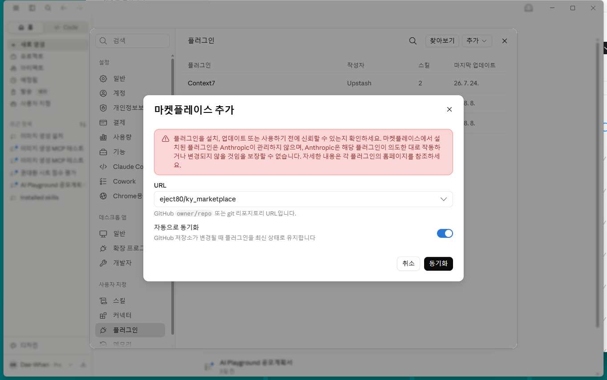
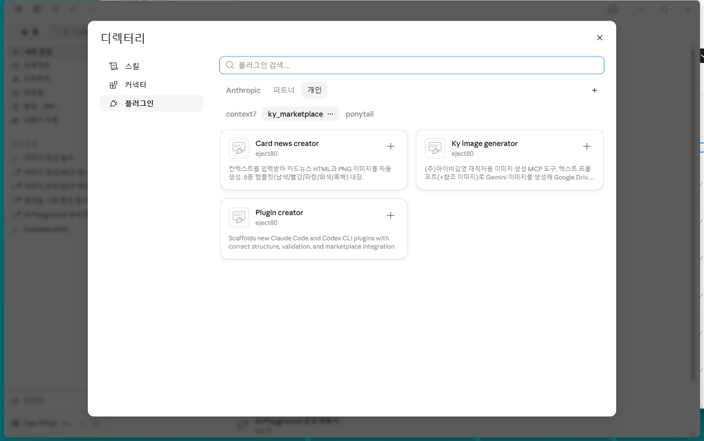
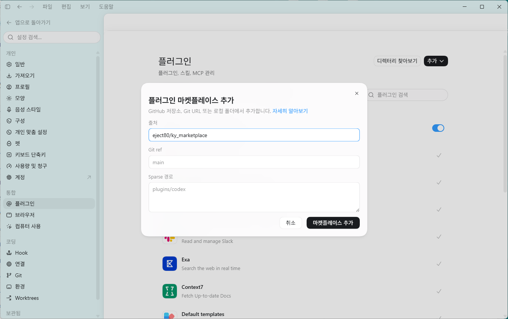
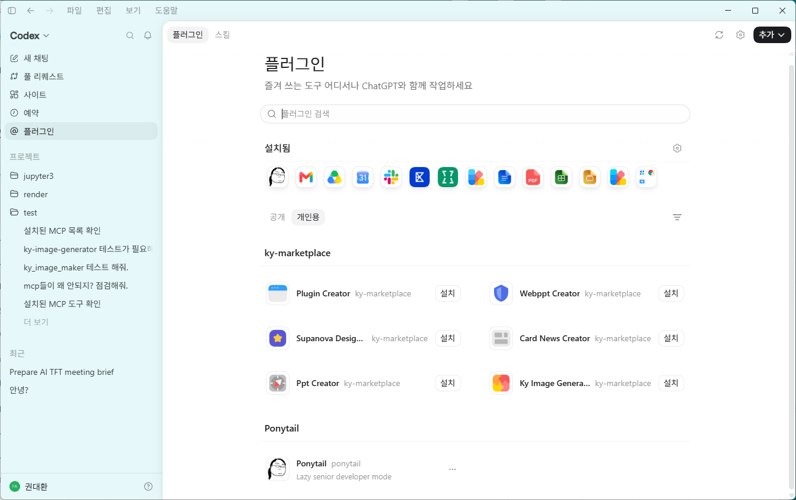

# ky-marketplace

**Claude Code / Codex CLI 플러그인 마켓플레이스.** PPT·카드뉴스·랜딩페이지 제작처럼 반복되는 작업을 스킬로 자동화하고, 사내 도구는 MCP 서버 연결로 제공한다.


---

## Install

### Claude Code 플러그인 마켓플레이스로 설치 (권장)

```
/plugin marketplace add eject80/ky_marketplace
```

원하는 플러그인만 골라 설치:

```
/plugin install plugin-creator@ky-marketplace
/plugin install WebPPT-creator@ky-marketplace
/plugin install Supanova-Design-Skill@ky-marketplace
/plugin install card-news-creator@ky-marketplace
/plugin install PPT-creator@ky-marketplace
/plugin install ky-image-generator@ky-marketplace
```

> `marketplace add`와 `install`은 같은 프롬프트에 이어 보내지 말고, 별도 프롬프트로 나눠 보낼 것 — 한 번에 보내면 설치가 안 될 수 있다.

### Codex CLI

```bash
codex plugin marketplace add eject80/ky_marketplace
```

원하는 플러그인만 골라 설치:

```bash
codex plugin add plugin-creator@ky-marketplace
codex plugin add WebPPT-creator@ky-marketplace
codex plugin add Supanova-Design-Skill@ky-marketplace
codex plugin add card-news-creator@ky-marketplace
codex plugin add PPT-creator@ky-marketplace
codex plugin add ky-image-generator@ky-marketplace
```

### Claude Desktop

Claude Desktop 앱도 Claude Code CLI와는 별도의 UI로 플러그인 마켓플레이스를 지원한다.

1. Claude Desktop을 열고 왼쪽 사이드바의 **사용자 지정**(Customize) 메뉴를 연다.
2. **플러그인**(Plugins) 탭 → 오른쪽 위 **추가** 드롭다운 → **마켓플레이스 추가**를 클릭한다.
3. **저장소에서 추가**를 선택하고, 검색창에 `eject80/ky_marketplace`를 입력해 선택한 뒤 **동기화**를 누른다.

   

4. 마켓플레이스가 추가되면 **찾아보기**를 눌러 플러그인 목록에서 원하는 걸 설치(+)한다.

   

> CLI의 `/plugin` 명령과 별개의 UI지만 같은 `.claude-plugin/marketplace.json`을 읽는다. `ky-image-generator`는 플러그인 설치만으로 끝나지 않는다 — 설치 후 플러그인 상세 화면의 **커넥터** 탭에서 `ky-image-generator` 커넥터를 한 번 더 연결해야 하고, 그때 브라우저로 사내 이메일 인증(OTP)이 뜬다.

### ChatGPT Desktop

ChatGPT 데스크톱 앱(Codex 통합 앱)도 마켓플레이스를 지원한다. Codex CLI용으로 이미 만들어 둔 `.agents/plugins/marketplace.json`을 그대로 읽으므로 저장소를 따로 손볼 필요가 없다.

1. ChatGPT 데스크톱 앱에서 좌측 상단 모드 전환으로 **Codex** 모드(또는 ChatGPT + Work 모드)로 바꾼다 — 플러그인 기능은 이 두 모드에서만 보인다.
2. **설정 → 플러그인**으로 들어간다.
3. 오른쪽 위 **추가** 드롭다운 → **마켓플레이스 추가**를 클릭한다.
4. **출처**에 `eject80/ky_marketplace`를 입력하고 **마켓플레이스 추가**를 누른다.

   

5. 사이드바에 뜨는 **플러그인 디렉터리**의 `ky-marketplace` 섹션에서 원하는 플러그인의 **설치**를 클릭한다.

   

> Plugins 기능은 ChatGPT Plus 이상 유료 플랜에서만 지원된다(OpenAI 공식 문서 기준). `ky-image-generator`는 설치 후 실제로 이미지 생성 툴을 처음 호출할 때 브라우저로 사내 이메일 인증(OTP)이 뜬다 — API 키 설정은 필요 없다.

### 로컬 clone으로 설치 (오프라인 사용, 직접 수정 시)

```bash
git clone https://github.com/eject80/ky_marketplace.git
```

```
/plugin marketplace add <클론한 경로>/ky_marketplace
```

설치 없이 바로 테스트해보고 싶다면:

```bash
claude --plugin-dir ./<plugin-name>
```

### 설치 전 확인

아래 3개의 플러그인은 추가 요구사항이 있다. 다른 플러그인은 요구사항이 없다:


| 플러그인               | 요구사항                                                                                                   |
| -------------------- | ---------------------------------------------------------------------------------------------------- |
| `PPT-creator`         | Node.js (`ppt-create`가 `pptxgenjs` 사용) · Windows + PowerPoint (`ppt-export`의 COM 자동화, Windows 전용)      |
| `card-news-creator`   | Playwright MCP (HTML → PNG 변환 시) · 인터넷 연결 (Pretendard 웹폰트 CDN)                                        |
| `ky-image-generator`  | (주)아이비김영 재직자 전용 · 최초 사용 전 브라우저로 사내 이메일 인증(OTP) 필요 — Claude Code는 자동, Codex CLI는 `codex mcp login ky-image-generator` 직접 실행 |


요구사항이 없으면 해당 기능이 조용히 실패하니, 위 표에 해당하는 플러그인만 설치 전에 준비해야 한다.

---

## 포함된 플러그인


| 플러그인                                             | 설명                                        | 주요 스킬                                      |
| ------------------------------------------------ | ----------------------------------------- | ------------------------------------------ |
| [`plugin-creator`](plugin-creator)               | 새 Claude Code 플러그인을 올바른 구조로 스캐폴딩          | `plugin-creator`                           |
| [`WebPPT-creator`](WebPPT-creator)               | 순수 HTML/CSS/JS 웹 슬라이드 프레젠테이션 생성 (번들러 불필요) | `webppt-create`                            |
| [`Supanova-Design-Skill`](Supanova-Design-Skill) | 프리미엄 한국어 랜딩페이지 디자인 시스템                    | `output` · `redesign` · `soft` · `taste`   |
| [`card-news-creator`](card-news-creator)         | 컨텍스트 입력 → 카드뉴스 HTML + PNG 자동 생성 (템플릿 8종)  | `card-news-create`                         |
| [`PPT-creator`](PPT-creator)                     | 12×24 그리드 기반 PPTX 생성·이미지 내보내기·슬라이드 수정     | `ppt-create` · `ppt-export` · `ppt-review` |
| [`ky-image-generator`](ky-image-generator)       | Gemini 이미지 생성 → Google Drive 업로드 MCP 도구 (사내용) | — (MCP 도구만, 스킬 없음)                    |


각 플러그인의 자세한 사용법은 폴더별 README를 참고.

---

## 공지사항

**`ky-image-generator`는 Claude Code / Codex CLI가 아닌 다른 프로그램에서도 쓸 수 있다.** 프로그램에 따라 연결 방식이 다르다:

| 프로그램 | 연결 방법 | 인증 |
| --- | --- | --- |
| Claude Desktop | 이 마켓플레이스를 그대로 설치 (위 [Claude Desktop](#claude-desktop) 참고) | 자동 OAuth (사내 이메일 인증) |
| ChatGPT Desktop | 이 마켓플레이스를 그대로 설치 (위 [ChatGPT Desktop](#chatgpt-desktop) 참고) | 자동 OAuth (사내 이메일 인증) |
| Chatbox AI 등 마켓플레이스를 지원하지 않는 프로그램 | `ky-image-generator`만 개별 연결 | API 키 |

- (주)아이비김영 재직자만 사용 가능하다.
- API 키가 필요한 경우 발급처: https://api.kimyoung.work/llm-gateway/my-key
- 서버 주소(URL): `https://api.kimyoung.work/mcp/image-generator`

Chatbox AI용 API 키 절차·JSON 설정 예시·스크린샷은 [`ky-image-generator/README.md`](ky-image-generator/README.md#다른-프로그램-수동-설치) 참고.

---

## Uninstall


| 구분          | 명령                                               | 설명                         |
| ----------- | ------------------------------------------------ | -------------------------- |
| Claude Code | `/plugin uninstall <name>@ky-marketplace`        | 플러그인 제거 (Claude Code)      |
| Claude Code | `/plugin marketplace remove ky-marketplace`      | 마켓플레이스 자체 제거 (Claude Code) |
| Codex CLI   | `codex plugin remove <name>@ky-marketplace`      | 플러그인 제거 (Codex CLI)        |
| Codex CLI   | `codex plugin marketplace remove ky-marketplace` | 마켓플레이스 자체 제거 (Codex CLI)   |


전체 관리 UI는 `/plugin`, 업데이트는 `/plugin update <name>@ky-marketplace` · `/plugin marketplace update ky-marketplace`.

---

## 새 플러그인 추가하기

`plugin-creator`가 설치된 대화에서 요청 한 줄이면 충분:

```
"obsidian-tools라는 skills 플러그인 만들어줘. Obsidian 노트 관리 자동화"
```

마켓플레이스 구조, `marketplace.json` 관리 규칙, 버전 범프 절차 등 유지보수 관련 내용은 [CLAUDE.md](CLAUDE.md) 참고.

---

## License

각 플러그인은 자체 `LICENSE` 파일을 갖는다 (전부 MIT). 마켓플레이스 저장소 자체에는 별도 라이선스가 없다.