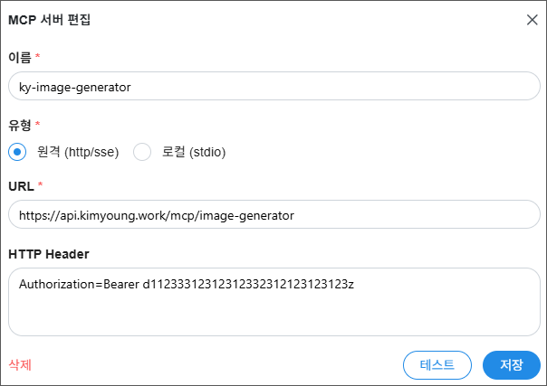

# ky-image-generator

(주)아이비김영 재직자용 이미지 생성 MCP 도구. 텍스트 프롬프트(+참조 이미지)를 받아 Gemini로 이미지를 생성하고, 결과를 Google Drive에 업로드해 파일 ID와 미리보기 링크를 반환한다.

이 플러그인은 스킬 없이 MCP 서버 연결만 제공한다 — 설치하면 `ky-image-generator` MCP 서버가 등록되고, `generate_image` 툴을 대화 중에 바로 호출할 수 있다.

## 사전 준비

(주)아이비김영 재직자만 사용 가능하다. Claude Code, Claude Desktop, Codex CLI 모두 OAuth(사내 이메일 인증)를 쓴다 — 로그인을 트리거하는 방식만 다르다.

## 설치

### Claude Code

```
/plugin marketplace update ky-marketplace
/plugin install ky-image-generator@ky-marketplace
```

별도 사전 설정이 필요 없다. 설치 후 `generate_image` 툴을 처음 호출하면 브라우저가 열리고, 사내 이메일로 받은 인증번호(OTP)를 입력하면 연결된다. 로그인은 15분 access token / 30일 refresh token으로 유지되며, 만료되면 다시 이메일 인증을 거친다.

설치 없이 바로 테스트:

```bash
claude --plugin-dir ./ky-image-generator
```

### Codex CLI

```bash
codex plugin marketplace upgrade ky-marketplace
codex plugin add ky-image-generator@ky-marketplace
```

Codex CLI는 Claude Code와 달리 첫 툴 호출에서 자동으로 로그인 창이 뜨지 않는다 — 설치 후 아래 명령을 직접 한 번 실행해야 한다:

```bash
codex mcp login ky-image-generator
```

브라우저가 열리면 사내 이메일로 받은 인증번호(OTP)를 입력한다. 로그인 세션이 만료되면 같은 명령을 다시 실행한다.

### Claude Desktop

Claude Desktop 앱은 마켓플레이스 전체를 설치할 수 있다 — 절차는 [루트 README의 Claude Desktop](../README.md#claude-desktop) 참고. 설치 후에는 Claude Code와 동일하게, `generate_image` 툴을 처음 호출하면 브라우저로 사내 이메일 인증(OTP)이 뜬다. 별도 API 키 설정은 필요 없다.

### 다른 프로그램 (수동 설치)

Claude Code, Claude Desktop, Codex CLI가 아니어도 MCP 서버를 직접 등록할 수 있는 프로그램이라면 이 도구를 쓸 수 있다. 프로그램이 OAuth를 지원하는지에 따라 방법이 다르다.

#### OAuth를 지원하는 프로그램 (ChatGPT Desktop 등)

API 키 없이 사내 이메일 인증만으로 연결한다.

**ChatGPT Desktop**

1. ChatGPT 왼쪽 위 프로필 아이콘 → **Settings** → **Apps & Connectors** → 맨 아래 **Advanced Settings**에서 **Developer mode**를 켠다.
2. **Settings → Apps & Connectors → Create**를 클릭하고 아래 값을 입력한다.

   | 항목 | 값 |
   | --- | --- |
   | Name | `ky-image-generator` |
   | Connector URL | `https://api.kimyoung.work/mcp/image-generator` |
   | Authentication | `OAuth` |

3. **Create**를 클릭하면 브라우저 인증 창이 뜬다. 사내 이메일로 받은 인증번호(OTP)를 입력하면 연결된다.

> ChatGPT의 Developer mode·MCP 커넥터는 유료 플랜(Plus 이상)에서만 지원된다. Business/Enterprise 워크스페이스는 관리자가 Developer mode를 먼저 켜줘야 할 수 있다.

#### API 키만 지원하는 프로그램 (Chatbox AI 등)

이 경우엔 로그인 대신 **API 키**를 발급받아 쓴다.

**1. API 키 발급받기**

- (주)아이비김영 재직자만 발급받을 수 있다.
- 아래 주소에 접속해서 로그인한 뒤 발급받는다:
  https://api.kimyoung.work/llm-gateway/my-key

**2. 프로그램에 연결 정보 입력하기**

프로그램의 "MCP 서버 추가" 또는 "커넥터 추가" 화면에 아래 두 가지를 입력한다:

| 항목 | 값 |
| --- | --- |
| 서버 주소(URL) | `https://api.kimyoung.work/mcp/image-generator` |
| HTTP 헤더 | `Authorization=Bearer 발급받은_API_키` |

`발급받은_API_키` 자리에 1번에서 받은 키를 그대로 붙여넣으면 된다.

Chatbox AI 기준 실제 입력 화면 예시:



**3. JSON으로 직접 설정해야 하는 프로그램이라면**

```json
{
  "mcpServers": {
    "ky-image-generator": {
      "type": "http",
      "url": "https://api.kimyoung.work/mcp/image-generator",
      "headers": {
        "Authorization": "Bearer 발급받은_API_키"
      }
    }
  }
}
```

> `발급받은_API_키` 부분만 실제로 발급받은 키로 바꿔서 쓴다. API 키는 비밀번호와 같으니 다른 사람과 공유하거나 채팅·문서·화면 캡처 등 공개된 곳에 올리지 않는다.

## 사용법

설치 후 대화 중에 원하는 이미지를 설명하면 `generate_image` 툴이 호출된다. 입력 가능한 옵션:

- `prompt` (필수) — 생성할 이미지 설명
- `model` — `gemini-3.1-flash-lite-image` / `gemini-3.1-flash-image`(기본) / `gemini-3-pro-image`
- `aspect_ratio` — `AUTO`(기본) / `1:1` / `2:3` / `3:2` / `3:4` / `4:3` / `9:16` / `16:9` / `21:9`
- `image_size` — `1K`(기본) / `2K` / `4K`
- `image_input_list` — 참조 이미지 URL 또는 data URL (최대 8개)

결과는 Google Drive 파일 ID, 미리보기 링크(`preview`), 뷰 링크(`webViewLink`)를 포함한 형태로 반환된다.

## 문제 해결

- 인증 오류가 나거나 로그인이 안 되면 재직 여부(퇴사자는 로그인해도 차단됨)를 우선 확인한다.
- **Claude Code / Claude Desktop**: 브라우저 로그인이 안 뜨면 재연결을 시도한다(Claude Code는 `/mcp`).
- **Codex CLI**: "not logged in" 오류가 나면 `codex mcp login ky-image-generator`를 다시 실행한다.
- **ChatGPT Desktop**: 커넥터에 도구가 안 뜨면 Developer mode가 켜져 있는지 확인하고, 대화를 새로 시작해 도구 목록을 새로고침한다.
- **Chatbox AI 등(API 키 방식)**: 인증 오류가 나면 [API 키 발급 페이지](https://api.kimyoung.work/llm-gateway/my-key)에서 키가 살아있는지, HTTP 헤더를 `Authorization=Bearer 발급받은_API_키` 형식 그대로 입력했는지 확인한다.
